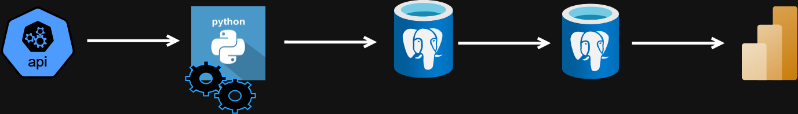
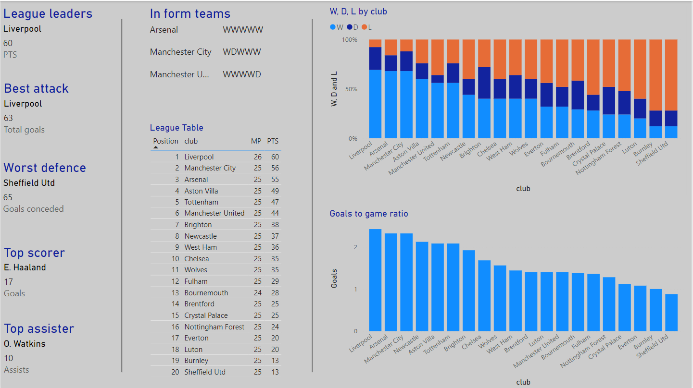

# Premier league ETL project
This an ETL (Extract, Transform, Load) project developed using Python & PLPGSQL. The ETL process retrieves football-related information from a football API (RAPIDAPI) and loads it into a Postgres database.

## Project workflow
1.	Data ingestion
Ingest English Premier League 2023/24 football data from Rapid API. The data collected consists of:
* Match results
*	Upcoming fixtures
*	League standings
*	Top goal scorer
*	Top goal assister

2.	Data transformation
Python scripts that convert data from json format to a data frame, changes data types, rename fields and drop fields.

3.	First data load
Transformed data is transferred to Postgres staging schema using a sqlalchemy engine

4.	Second data load
Once all staging tables are successfully populated, a python fuction will use psycopg2 to create a cursor that will call stored procedures:
These stored procedures insert or upsert data from the staging tables to the main core tables depending on the insert constraints.

5.	Truncate staging tables
Whether the load to the core tables is successful or not the tables are truncated (emptied) as the tables aren’t used for data storage.

6.	Changes to league standings table logged
Use Postgres trigger function that inserts a new row of club name, rank and points to log table whenever a clubs points or rank is updated.

## Project configuration
Environment variables:

These are either sensitive variables or variables I don’t want being changed now or in the future:
*	header_api_key: API key used for header parameter for accessing football data via the RapidAPI platform
*	hearder_url: Used for header parameter to for accessing football data via the RapidAPI platform
*	season: Specify the football season for data retrieval.
*	league: Identify the football league for which data is being collected.
*	to_staging_string: Used as sql alchemy Postgres connection string
*	to_core_string_host: Used for Psycopg2 connection string
*	to_core_string_user: Used for Psycopg2 connection string
*	to_core_string_password: Used for Psycopg2 connection string
*	to_core_string_db_name: Used for Psycopg2 connection string
*	to_core_string_port: Used for Psycopg2 connection string

Postgres configuration:

I already had Postgres desktop downloaded on my computer. For the project I had to:
*	Create a database
*	Create a staging and core schema.
*	Create tables in the staging and core schema, ensuring the staging and core tables had the correct field names and data types and or constraints. 

Power BI configuration:

I already had Power BI desktop downloaded on my computer. I just needed to connect to my Postgres database to import the core tables.

RapidAPI configuration:

I signed up for a RapidAPI account and obtained an API key. I then subscribed to the football API; free subscription that gives me 100 requests a day.

## Power BI dashboard:

